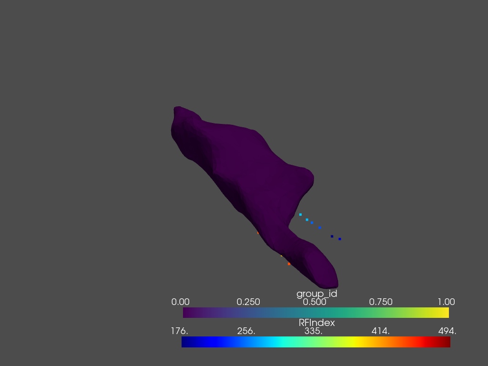

# CARTOreader - lite

[](https://github.com/thomgrand/cartoreader-lite/actions/workflows/python-package.yml)
[](https://codecov.io/gh/thomgrand/cartoreader-lite)

This repository is an inofficial reader to easily process exported [CARTO3 data](https://www.jnjmedicaldevices.com/en-US/product/carto-3-system) in Python.
It does not provide the more extensive capabilities to analyze the signals, such as [OpenEP](https://openep.io/), but is rather meant as a simple reader to import CARTO data. 
The loaded time data is imported in [pandas](https://pandas.pydata.org) and the meshes in [VTK](https://vtk.org/) provided through [PyVista](https://www.pyvista.org), allowing for easy access, export and interoperatibility with existing software.

# Installation

To install `cartoreader_lite`, you can simply install the package from PyPI:

```bash    
pip install cartoreader-lite
```

Alternatively, you can clone the repository and install the libary using `pip`.

```bash    
git clone https://github.com/thomgrand/cartoreader-lite
cd cartoreader-lite
pip install -e .
```

# Usage

To test the library, you first need to get CARTO3 data. 
None is provided with this repository, but you can download the testing data provided by [OpenEP](https://openep) to quickly try out the library (make sure the libary was installed first):

```bash
python tests/generate_test_data.py
```

```python
from cartoreader_lite import CartoStudy
import pyvista as pv
import numpy as np

study_dir = "openep-testingdata/Carto/Export_Study-1-11_25_2021-15-01-32"
study_name = "Study 1 11_25_2021 15-01-32.xml"
study = CartoStudy(study_dir, study_name, 
                carto_map_kwargs={"discard_invalid_points": False} #All points of the example are outside the WOI, which would be by default discarded
                )
ablation_points = pv.PolyData(np.stack(study.ablation_data.session_avg_data["pos"].to_numpy()))
ablation_points.point_data["RFIndex"] = study.ablation_data.session_avg_data["RFIndex"]
plotter = pv.Plotter()
plotter.add_mesh(ablation_points, cmap="jet")
plotter.add_mesh(study.maps[2].mesh)
plotter.show()
```

You should see the recorded map of the [OpenEP](https://openep.io) example, together with its recorded points like below.



# Documentation

[https://cartoreader-lite.readthedocs.io/en/latest](https://cartoreader-lite.readthedocs.io/en/latest)

